# ​Table of contents 

1. **Presentation** *(Guillaume)*
2. **Installation**  
2.1. Mac *(Luca)*  
2.2. Linux / Windows via WLS *(Guillaume)*  
2.3. Windows *(Quentin)*
3. **Tutorial / Main existing commands** *(Quentin)*

# 1) Easy commands #

**To start redis, we just need to put on the cmd the command redis-cli once you have installed it:**

C:\....>redis-cli

    127.0.0.1:6379>

Once the client is started, we can start using redis.

## GET and SET commands ##

Redis is a tool which mainly allow to set and get a key.
 **To set a key use SET and to get a key use GET.**

Example : 

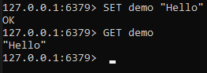

Of course this is an easy example.
 **It can be more complex by adding an id on an user for example.**

Example :

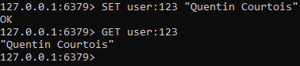

**To delete those key you just have to use the command DEL.**

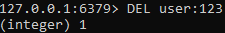

It will return 1 if the operation has been done successfully
 **If we try to get that key after the DEL command, it will always return us "nil"**

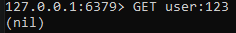

## INCR and DECR commands ##

**Let's say we want to put a counter in a key, there is an easy command that let you do it : INCR**
 You just have to put INCR key and it will increment it 1 by 1 and will return the value that has been incremented 
 If there is a lot of concurrence concerning this value and the incrementation of it, redis and this command allows the program 
not to have problem ( example with a website for example : if people are connecting simultaneously on the website )
 You also don't have to precise a value when you first create the key and the value, by default it is "0"
 Example :

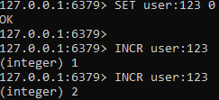

 **You can also decrement a value of a key with "DECR":**

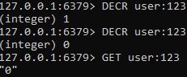

Overall this first command make the management of the cache easier

## TTL and EXPIRE ##

**If we want to know the time to live of a value in redis we can use the command "TTL":**
Example : 

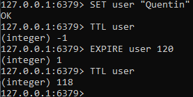

In this example there are multiple things we need to know : 
  1) First when you create a key with values, its lifetime is infinite if the data doesn't exceed the limitation of the RAM
         That's why it will return -1 when you first ask its TTL ( -1 means infinite here, -2 means key doesn't exist )
 **2) You can define the lifetime a key by simply using the command "EXPIRE" and putting the number of seconds you want it to last after**
  3) If we ask again for the TTL we see that it return the number of seconds it has left to live.
  4) If you put an expiration date on a key and you change the value of a key after it, the TTL is reset and doesn't expire anymore

All those easy command were used on easy variables types for now ( integer, String, .. ). 
 **However redis has the possibility to also use Lists**

# 2) Store a List in redis, basic list #

## RPUSH and LPUSH commands ##

**RPUSH means "right push"**
 **LPUSH means "left push"**
  Meaning that if you want to insert a value in a list from the right use RPUSH, and from the left use LPUSH

## To get elements of a list, we DON'T use GET but instead we use LRANGE ##

**To get all informations from a list, we use LRANGE and we can use those ways :**
 1) just with LRANGE "name"
 2) with the same command and the index at the end : LRANGE "name" 0 -1 ( for all elements in the list )
 3) It is indexed from 0 to n 

Example : 

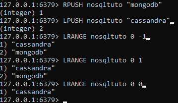

There are other operations you can do on the lists suchs as : 
 1) LLEN "name" : length of the list
 2) LPOP (or RPOP) "name" : to delete an element right or left
 3) LINDEX "name" nb : to get a value of your list at index nb
  and more... ( see documentation )

Example :

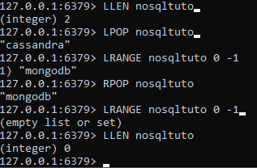

# 3) Store a List in redis, using SETS #

Set allows to save key with value that can't appear in double. These are unique keys.
 To do that we use the command SADD "name" "key". 
 You'll see that if try to add a value already in the set, the operation returns 0

Example :

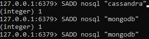

 Some precisions : 
 1) Sets don't have any order so we can't use LPOP or RPOP
 2) to see elements of a set use : SETMEMBERS "name"
 3) to delete an user use : SREM "name" "key"

Example :

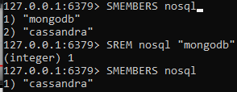

To check whether a key is present is the set, you can use : SISMEMBER "name" "key"
 returns 0 if not present or 1 if present in the set
 You can also concatenate sets using : SUNION "name" "name2"
 You can also make sorted set using the command ZADD "name" "value" "key" ( same as sets but with Z instead )

Example : 

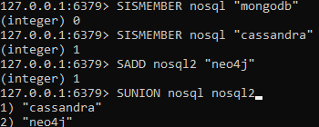

# 4) Store a List in redis, using HASH #

HASH is more of an object or a mini DB that is organised this way : 
 1) an HASH has key, this key has a list of key
 2) Each of thoses keys reprensents a value
 3) Imagine a person with attributes : age,name,birthdate,...
 Each of those attributes are a key of the person which is a key

Example : 

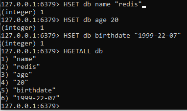

 You can also do all those command in one simple line using "HMSET".

Example :

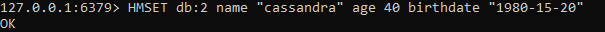

 We can do all sorts of operations on it, one simple op is for example : 
 increment a value, for our example the age of a db: 

Example :

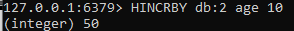

 You can get all the keys and value of a hash:
 1)HKEYS "name"
 2)HVALS "name" 

Example : 

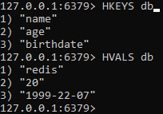

That's about it for the first commands that you need to know for using REDIS. 

4. **Use case** *(Luca)*
5. **Performance Analysis** *(Matthieu)*  
5.1. Pros of Redis  
5.2. Cons of Redis
6. **Redis comparison with the others**  
6.1. Advantages  
6.2. Inconvenients
7. **Conclusion**

## Presentation
## Installation
### Mac
### Linux / Windows via WLS
### Windows
## Tutorial / Main existing commands
## Use case
## Performance Analysis

### Redis has an implemented method called benchmark which permit to “simulate” a multi user query on the database in order to test the capacity and the speed of responses.  

      ====== PING_INLINE ======
    100000 requests completed in 1.69 seconds
    50 parallel clients
    3 bytes payload
    keep alive: 1
    host configuration "save": 900 1 300 10 60 10000
    host configuration "appendonly": no
    multi-thread: no

    0.00% <= 0.1 milliseconds
    0.01% <= 0.2 milliseconds
    2.00% <= 0.3 milliseconds
    8.97% <= 0.4 milliseconds
    21.75% <= 0.5 milliseconds
    37.94% <= 0.6 milliseconds
    55.28% <= 0.7 milliseconds
    71.61% <= 0.8 milliseconds
    84.37% <= 0.9 milliseconds
    91.96% <= 1.0 milliseconds
    96.31% <= 1.1 milliseconds
    98.51% <= 1.2 milliseconds
    99.47% <= 1.3 milliseconds
    99.78% <= 1.4 milliseconds
    99.87% <= 1.5 milliseconds
    99.92% <= 1.6 milliseconds
    99.94% <= 1.7 milliseconds
    99.96% <= 1.8 milliseconds
    99.97% <= 1.9 milliseconds
    99.99% <= 2 milliseconds
    100.00% <= 2 milliseconds
    59101.65 requests per second
    
## __here 100000 PING_INLINE query are performed by 50 parallel users in 1.69 seconds  at a speed of 59101.65 requests/second__

    ====== PING_BULK ======
    100000 requests completed in 1.54 seconds
    50 parallel clients
    3 bytes payload
    keep alive: 1
    host configuration "save": 900 1 300 10 60 10000
    host configuration "appendonly": no
    multi-thread: no

    93.22% <= 1 milliseconds
    99.21% <= 2 milliseconds
    99.74% <= 3 milliseconds
    99.88% <= 4 milliseconds
    99.94% <= 5 milliseconds
    99.96% <= 6 milliseconds
    99.99% <= 7 milliseconds
    100.00% <= 7 milliseconds
    64808.82 requests per second

## __here 100000 PING_BULK query are performed by 50 parallel users in 1.54 seconds  at a speed of 64808.82 requests/second__ 

    ====== SET ======
    100000 requests completed in 1.70 seconds
    50 parallel clients
    3 bytes payload
    keep alive: 1
    host configuration "save": 900 1 300 10 60 10000
    host configuration "appendonly": no
    multi-thread: no

    91.78% <= 1 milliseconds
    99.96% <= 2 milliseconds
    100.00% <= 2 milliseconds
    58892.82 requests per second
 
## __here 100000 SET query are performed by 50 parallel users in 1.70 seconds  at a speed of 58892.82 requests/second__  

    ====== GET ======
    100000 requests completed in 1.55 seconds
    50 parallel clients
    3 bytes payload
    keep alive: 1
    host configuration "save": 900 1 300 10 60 10000
    host configuration "appendonly": no
    multi-thread: no

    96.35% <= 1 milliseconds
    100.00% <= 2 milliseconds
    100.00% <= 2 milliseconds
    64683.05 requests per second
 
 ## __here 100000 GET query are performed by 50 parallel users in 1.55 seconds  at a speed of 64683.05 requests/second__ 

    ====== INCR ======
    100000 requests completed in 1.61 seconds
    50 parallel clients
    3 bytes payload
    keep alive: 1
    host configuration "save": 900 1 300 10 60 10000
    host configuration "appendonly": no
    multi-thread: no

    94.87% <= 1 milliseconds
    100.00% <= 2 milliseconds
    100.00% <= 2 milliseconds
    61957.87 requests per second

## __here 100000 INCR query are performed by 50 parallel users in 1.61 seconds  at a speed of 61957.87 requests/second__ 
    

## *request throughput per seconde in function of the size of data* 

## *Request output per second in function of the number of connections*
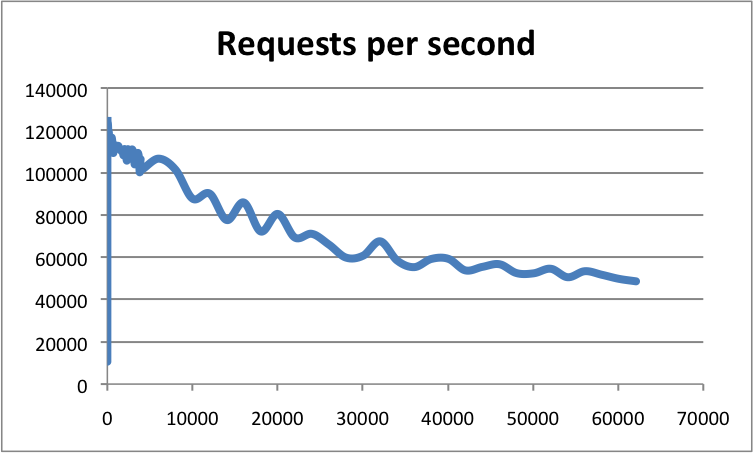

### Comparison pro and cons Redis and other Framework

|Framwork | PRO | CONS
------ | ---|-----
   __Cassandra__ | - fully distributed database update nodes with rolling restarts   -Linear scalability the same application can scale from laptop to a webservice with billions of rows in a table  -Amazing performance you can get answers in milliseconds. Cassandra excels at recording, processing, and retrieving time-series data.|-Cassandra runs on the JVM and therefor may require a lot of GC tuning for read/write intensive applications.  -Requires manual periodic maintenance - for example it is recommended to run a cleanup on a regular basis.  -There are a lot of knobs and buttons to configure the system. For many cases the default configuration will be sufficient, but if it’s not - you will need significant ramp up on the inner workings of Cassandra in order to effectively tune it. 
  __MongoDB__     | -Easy to learn you can figure out how to use MongoDB pretty fast.  -Fast performance. lots of ready-made solutions out there.  -There's a lot of support in the existing ecosystem Query syntax is pretty simple to grasp and utilize.  -Aggregate functions are powerful. Scaling options. Documentation is quite good and versioned for each release.  -Horizontally scalable database Performance is very high   | -An aggregate pipeline can be a bit overwhelming as a newcomer.  -There's still no real concept of joins with references/foreign keys, although the aggregate framework has a feature that is close.   -Database management/dev ops can still be time-consuming if rolling your own deployments.  -Doesn’t support joins Data Size is High Nesting of documents is limited Increase unnecessary usage of memory By design, joined collections tend to be much slower than in relational DB. 
  __Neo4j__   | -Neo4j is fast.  -Neo4j has its own query language CYPHER which is very intuitive and easy to use.  -Neo4j supports API in almost every language like Java, Python, PHP, NodeJS Easy way to query data.  -Easy way to insert and store relationships.    -Easy to visualize data in Neo4j browser.   -Easy to learn.       |  -Doesn't have native support for complex properties for nodes and relationships   -Sometimes hard to visualize complex data analyses.   -Tough to see space used.   -Tough to allocate memory or other configurations.   -not easy to configure for a large dataset graphic   -not clear for complex dataset in which more than 10 relation possible graphs are not good Also the interactive UI for a complex dataset is little bit complex 
__Redis__ |-Easy for developers to understand.   -Reliable. With a proper multi-node configuration, it can handle failover instantly.   -Configurable uses Redis for both long-term storage and temporary expiry keys without taking on another external dependency.   -Fast tens of thousands of RPS and it doesn't skip a beat. Supports a huge variety of data types   -Easy to install Operations are atomic Multi-utility tool (used in a number of use cases)  | -Some difficulty scaling Redis without it becoming prohibitively expensive.   -Redis has very simple search capabilities, which means it’s not suitable for all use cases.   -Redis doesn't have good native support for storing data in object form and many libraries built over it return data as a string, meaning you need build your own serialization layer over it.  -Doesn’t support joins Knowledge required of Lua for stored procedures the dataset has to fit comfortably in memory 

## Conclusion
