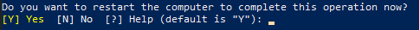
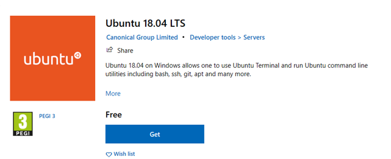
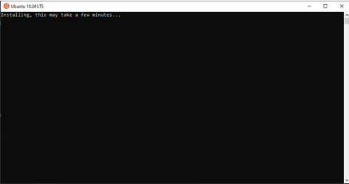
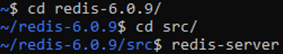
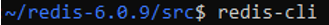
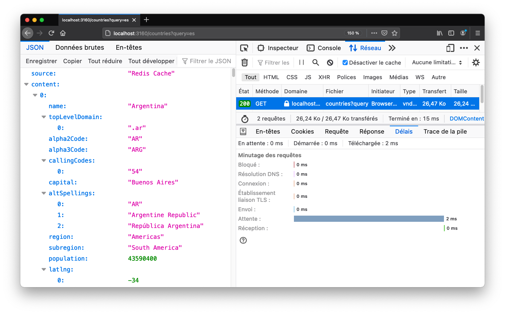

<style>
	h1, h2, h3, h4, h5, div, p, ol, table {
		font-family: CMU Serif;
	}
	div.pagebreak {
		page-break-after: always;
	}
	#title {
		text-align: center;
	}
	#logo {
		margin-top: 30%;
		width: 75%;
	}
</style>

<div id="title">
	<h1>NoSQL - Redis Database</h1>
	<br/><p>COURTOIS Quentin – ECCHER Matthieu
	<br/>JAOUEN Guillaume – VAIO Luca</p>
	<p>December 15, 2020</p>
	
</div>

<div class="pagebreak"></div>


# ​Table of contents 

1. **Presentation**
2. **Installation**  
2.1. macOS  
2.2. Linux 
2.3. Windows
3. **Basic tutorial**  
3.1. Easy commands  
3.2. Lists  
3.3. Sets  
3.4. Hashes
4. **Use cases**  
4.1. Caching  
4.2. Pub/Sub  
4.3. Geospatial 
5. **Performance Analysis**
6. **When to choose Redis?**  
6.1. Pros  
6.2. Cons
7. **Conclusion**


<div class="pagebreak"></div>


## Presentation

<span style="color: red">

Since 2009, Redis (Remote Dictionary Server) appeared on the technologies market. This new open source project of DBMS (Database Management System) implementing a distributed, in memory “key-value” was created by Salvatore Sanfilippo & Pieter Noordhuis. This database is working with N0-SQL implementation.
Today, several international compagnies are using this technology such as Twitter, GitHub, Snapchat, StackOverflow, Flickr …
How Redis works?

First of all, Redis is a database management tool which can save information in a simple format of “key - value”. All the information is stock in memory instead of the hard drive, so you can imagine the speed of data processing.  Redis offer many data structure such as a high availability (Scalability), transactions, high persistence on hard disk and the cluster supports.
Moreover, Redis allows the management of different types of data, for example:   
*	Strings (maximal size per strings: 512 Mo)    
*	List   
*	Hashes   
*	Sets    
*	Streams (list of strings or complex “key - value”)   
*	…   

This management database supports all the following languages: Python, JAVA, JavaScript, Node.js, R, C, C++, C# and so on.
</span>

See: https://redis.io/topics/persistence


<div class="pagebreak"></div>


## Installation

First of all, you should know that Redis is a BSD-licensed software. It has been developed for POSIX systems, and is therefore fully compatible with macOS and Linux. For Windows, a version has been ported but does not include the latest updates. However, as we will see, there is a way to take advantage of it under Windows 10.

### macOS

The easiest and most direct way to install Redis is to compile the source code directly. The only prerequisite is the GCC compiler.

```sh
wget http://download.redis.io/redis-stable.tar.gz
tar xvzf redis-stable.tar.gz
cd redis-stable
make
```

Then simply run the `redis-server` binary to start Redis.

Running Redis from the command line is fine for testing, however for an application on a real server it is not a correct installation. Also, with the installation we just did Redis does not keep itself up to date.

One solution is to create a system service, managing Redis automatically at startup. Under macOS, a service is done using `.plist` files.
<br/>However, under macOS as under Linux, it is preferable to use package managers to solve these problems. To date, the best existing under macOS is Homebrew.

So let's install Homebrew, then start Redis.

```sh
/bin/bash -c \
"$(curl -fsSL https://raw.githubusercontent.com/Homebrew/install/HEAD/install.sh)"
brew install redis
brew services start redis
```

That's it, Redis is ready to be used and maintained over time!

### Linux

For Linux distributions, the principle is the same as under macOS. The best is of course to use the integrated package manager, for instance `apt` or `dnf`.

### Windows via WLS

<span style="color: red">

* Step 1:   

Open a PowerShell window as Administrator. Run the following command:

```
Enable-WindowsOptionalFeature -Online -FeatureName Microsoft-Windows-Subsystem-Linux
```

Few seconds later, the message below appears:



Tap : Y to restart your computer

* Step 2: 

Open the Windows Store application from your system.   
In the search bar, tap “Ubuntu”. Download it. (Same application as the image below)



After downloading this application, launch it.   
This screen should be appeared (Wait few minutes)



* Step 3:

Tap the following command (wait for the end of the process of each order):

```
sudo apt-get update
sudo apt-get upgrade
sudo apt-get install redis-server
redis-cli -v
```

Restart the server, to make sure is running:

```
sudo service redis-server restart
```

* Step 4:

After that, you need to go through the folder redis and source as the image below :



* Step 5:

Open a new Ubuntu window, going through the folder redis and source as the image below:



Congratulations !  You can now use redis !
</span>


<div class="pagebreak"></div>


## Basic tutorial

### 1. Easy commands ###

**To start the Redis client, simply type the command `redis-cli` on a terminal once the installation is complete.**

	$ redis-cli
	127.0.0.1:6379>

Once the client is started, we can start using redis.

#### `GET` and `SET` commands ####

In essence, Redis is a key-value store. It therefore allows SET and GET commands to be executed on a certain key.
<br/>**To set a key use SET and to get a key use GET.**

Example : 

	127.0.0.1:6379> SET demo "Hello"
	OK
	127.0.0.1:6379> GET demo
	"Hello"

Of course this is an easy example.
<br/>**It can be more complex by adding an id on an user for example.**

Example :

	127.0.0.1:6379> SET user:123 "Quentin Courtois"
	OK
	127.0.0.1:6379> GET user:123
	"Quentin Courtois"

**To delete those key you just have to use the command DEL.**

	127.0.0.1:6379> DEL user:123
	(integer) 1

It will return 1 if the operation has been done successfully.
<br/>**If we try to get that key after the DEL command, it will always return us "nil".**

	127.0.0.1:6379> DEL user:123
	(nil)

#### `INCR` and `DECR` commands ####

Let's say we want to set a counter on a key. Redis can do it easily, with the command `INCR`.
<br/>Just write `INCR <key>` and it will increment it 1 by 1 and will return the value that has been incremented.
<br/>If there is a lot of concurrence concerning this value and its incrementation, Redis is managing it well (with a website for example : if people are connecting simultaneously).
<br/>You also don't have to precise a value when you first create the key and the value, by default it is `0`.
<br/>Example :

	127.0.0.1:6379> SET counter 0
	OK
	127.0.0.1:6379> INCR counter
	(integer) 1
	127.0.0.1:6379> INCR counter
	(integer) 2

<br/>**You can also decrement a value of a key with "DECR":**

	127.0.0.1:6379> DECR counter
	(integer) 1
	127.0.0.1:6379> DECR counter
	(integer) 0
	127.0.0.1:6379> GET counter
	"0"

Overall this first command make the management of the cache easier. <span style="color: red">***What do you mean here?***</span>


#### `TTL` and `EXPIRE` ####

Redis allows another very interesting feature, which is lifetime. Indeed, we can define a lifetime for a key, after which the key will be erased. As we will see, this is particularly useful when it comes to caching tokens.

**If we want to know the time to live of a value in redis we can use the command "TTL":**

Example : 

	127.0.0.1:6379> SET user "Quentin"
	OK
	127.0.0.1:6379> TTL user
	(integer) -1
	127.0.0.1:6379> EXPIRE user 120
	(integer) 1
	127.0.0.1:6379> TTL user
	(integer) 118

In this example there are multiple things we need to know : 

1. First when you create a key with values, its lifetime is infinite if the data doesn't exceed the limitation of the RAM.
<br/>That is why it will return `-1` when you first ask its `TTL` (`-1` means infinite here, `-2` means key doesn't exist)
2. **You can define the lifetime a key by simply using the command `EXPIRE` and putting the number of seconds you want it to last after**
3. If we ask again for the TTL we see that it return the number of seconds it has left to live.
4. If you put an expiration date on a key and you change the value of a key after it, the `TTL` is reset and does not expire anymore.

All those easy command were used on easy variables types for now (`integer`, `String`). 
<br/>**However redis has the possibility to also use lists.**

### 2. Store a `List` in Redis, basic list ###

#### `RPUSH` and `LPUSH` commands ####

`RPUSH` means "right push"
<br/>`LPUSH` means "left push"

Meaning that if you want to insert a value in a list from the right use `RPUSH`, and from the left use `LPUSH`.

To get elements of a list, we do not use `GET` but instead we use `LRANGE`:

1. Just with `LRANGE "name"`
2. With the same command and the index at the end : `LRANGE "name" 0 -1` (for all elements in the list. It is indexed from 0 to n)

Example : 

	127.0.0.1:6379> RPUSH nosqltuto "mongodb"
	(integer) 1
	127.0.0.1:6379> LPUSH nosqltuto "cassandra"
	(integer) 2
	127.0.0.1:6379> LRANGE nosqltuto 0 -1
	1) "cassandra"
	2) "mongodb"
	127.0.0.1:6379> LRANGE nosqltuto 0 1
	1) "cassandra"
	2) "mongodb"
	127.0.0.1:6379> LRANGE nosqltuto 0 0
	1) "cassandra"

There are other operations you can do on the lists suchs as : 

1. `LLEN "name"` : length of the list
2. `LPOP` (or `RPOP`) `"name"` : to delete an element right or left
3. `LINDEX "name" nb` : to get a value of your list at index nb

and more... (see the [documentation](https://redis.io/documentation))

Example :

	127.0.0.1:6379> LLEN nosqltuto
	(integer) 2
	127.0.0.1:6379> LPOP nosqltuto
	"cassandra"
	127.0.0.1:6379> LRANGE nosqltuto 0 -1
	1) "mongodb"
	127.0.0.1:6379> RPOP nosqltuto
	"mongodb"
	127.0.0.1:6379> LRANGE nosqltuto 0 -1
	(empty list or set)
	127.0.0.1:6379> LLEN nosqltuto
	(integer) 0

### 3. Store a list in Redis using `Sets` ###

With Redis, a set allows to save a key with value that cannot appear in double. These are unique keys.
<br/>To do that we use the command `SADD "name" "key"`. 
<br/>You'll see that when trying to add a value already existing in the set, the operation returns `0`.

Example :

	127.0.0.1:6379> SADD nosql "cassandra"
	(integer) 1
	127.0.0.1:6379> SADD nosql "mongodb"
	(integer) 1
	127.0.0.1:6379> SADD nosql "mongodb"
	(integer) 0

Some precisions : 

1. Sets don't have any order so we can't use `LPOP` or `RPOP`
2. To see elements of a set use : `SETMEMBERS "name"`
3. To delete an user use : `SREM "name" "key"`

Example :

	127.0.0.1:6379> SMEMBERS nosql
	1) "mongodb"
	2) "cassandra"
	127.0.0.1:6379> SREM nosq "mongodb"
	(integer) 1
	127.0.0.1:6379> SMEMBERS nosql
	1) "cassandra"

- To check whether a key is present is the set, you can use : `SISMEMBER "name" "key"`.
<br/>It returns `0` if not present or `1` if present in the set.
- You can also concatenate sets using : `SUNION "name" "name2"`
- You can also make sorted set using the command `ZADD "name" "value" "key"` (same as sets but with `Z` instead)

Example : 

	127.0.0.1:6379> SISMEMBER nosql "mongodb"
	(integer) 0
	127.0.0.1:6379> SISMEMBER nosql "cassandra"
	(integer) 1
	127.0.0.1:6379> SADD nosql2 "neo4j"
	(integer) 1
	127.0.0.1:6379> SUNION nosql nosql2
	1) "cassandra"
	2) "neo4j"


### 4. Store a list in Redis, using `Hash` ###

A Hash is more of an object or a mini database that is organised this way : 

1. A Hash has key, and this key has a list of key
2. Each of thoses keys reprensents a value
3. Imagine a person with attributes : age, name, birthdate, ...
<br/>Each of those attributes are a key of the person which itself is a key

Example : 

	127.0.0.1:6379> HSET db:1 name "redis"
	(integer) 1
	127.0.0.1:6379> HSET db:1 age 11
	(integer) 1
	127.0.0.1:6379> HSET db:1 birthdate "2009-05-10"
	(integer) 1
	127.0.0.1:6379> HGETALL db:1
	1) "name"
	2) "redis"
	3) "age"
	4) "11"
	5) "birthdate"
	6) "2009-05-10"

You can also do all those command in one simple line using `HMSET`.

Example :

	127.0.0.1:6379> HMSET db:2 name "cassandra" age 12 birthdate "2008-06-01"
	OK

We can do all sorts of operations on it, a simple one is incrementing a value, in our example the age of a db:

	127.0.0.1:6379> HINCRBY db:2 age 10
	(integer) 22

You can get all the keys and value of a hash:

1. `HKEYS "name"`
2. `HVALS "name"`

Example : 

	127.0.0.1:6379> HKEYS db:1
	1) "name"
	2) "age"
	3) "birthate"
	127.0.0.1:6379> HVALS db:1
	1) "redis"
	2) "11"
	3) "2009-05-10"

That's about it for the basic commands that you need to know for using Redis. 


<div class="pagebreak"></div>


## Use cases

We have seen the basic use that Redis proposes, but let's go further and explore concrete cases in which Redis is used in industry.

Indeed, Redis is still full of many useful features. So here are, in a non-exhaustive way, the most common use cases of Redis.

### 1. Caching

#### Why caching?

As we shall see later, Redis is renowned for its extremely high performance, often with a latency of less than a millisecond. This makes it an ideal solution for caching. Indeed, caching is the act of storing data in a temporary shop for later use and faster than recalculating the data.

In addition to this, as we have seen, Redis offers counter and queue functionality. All this gives Redis a prime position in a web application to store metadata and even files resulting from recurring queries. This will avoid the server having to systematically retrieve this data at the source.

But that's not all! As we have seen, Redis offers persistence and expiration time features. This allows a whole host of uses, including caching of user session data, containing authentication tokens, browsing history or other associated metadata.
<br/>Note that, moreover, a maximum cache size can be set with Redis.

So we see great potential for Redis. Now let's look at an example of a use case for this caching, and the benefits it brings.

In this case, and to show Redis' compatibility with various technologies, we will write our little application with Node.js.

#### Use case

First of all, and going through all the details, we configure our server to be able to communicate with Redis.
<br/>You will be able to find the full code attached with this report.

```js
const listenPort = 3160;
const app = express();

const redisPort = 6379;
const redisClient = redis.createClient(redisPort);
```

For this use case, we will use an API, called RESTCountries, that allows us to search the countries of the world according to different criteria. Here we will imagine that our application requires to know in which countries a certain language is spoken.

```js
return redisClient.get(`countries:${query}`, (err, result) => {
    if (result) {
        const resultJSON = JSON.parse(result);
        return res.status(200).json(resultJSON);
    }
    else {
        return axios.get(searchUrl)
        .then(response => {
            const responseJSON = response.data;
            redisClient.setex(`countries:${query}`, 3600,
                JSON.stringify({ source: 'Redis Cache', content: { ...responseJSON }, }));
            return res.status(200).json({ source: 'Countries API',
                content: { ...responseJSON }, });
        })
        .catch(err => {
            return res.json(err);
        });
    }
});
```

Here is how the server will return the response to the client. It first looks for a cache in the Redis database, and if none is found it requests the API to get the information and store it in Redis.
<br/>When the cache is recorded, Redis is told to give it a lifetime of one hour, or 3600 seconds.
<br/>At the beginning of the response it is indicated whether the data comes from the cache or from the API in order to find out where the data comes from.

Now let's launch two successive queries with the language "es", i.e. Spanish. Note that here we have deactivated the automatic caches (see images below), to really measure the performance of Redis' caches. Let's see the results.


*<div style="text-align: center;">Request without cache</div>*



*<div style="text-align: center;">Request with cache</div>*

The results are indisputable! Without caches, the request takes 190 ms, of which 176 ms is download time, which is already very fast because the API is well optimised (some could be much slower). With Redis caching, the request takes 15 ms, with only 2 ms download time!

The data download time is therefore divided by 88 with Redis caching, and it could be even faster in some other use cases. Hence, if we imagine an operation requiring 10 requests, the user could receive only 20 ms of download time instead of 1.8 seconds!

So we see the potential of Redis' caching. But that's not all, Redis still offers other use cases.

### 2. Real time feeds

#### Pub/Sub feature

Many features are still offered by Redis, and here we will talk about the publication and subscription functions, called PUB/SUB.

Indeed, Redis offers a service that allows you to subscribe to a stream of publications, called a "channel", and to publish content on this stream. This functionality opens up new fields of use, such as news feeds, real-time messaging, but also targeted advertising management or even dating applications such as carpooling. We later report that this last option can be enriched with a new Redis feature.

It should be noted that, by default, Redis does not offer any authentication mode, in order to further accelerate its performance. As a result, for all the Redis functionalities we present, including subscriptions and publications, it is up to each software using Redis to manage data access permissions. However, it is possible to encrypt communications with Redis and require an authentication.

Enough talk, let's try to implement this real-time flow management.

Still in order to show the broad compatibility of Redis, we will write our script in Python here.

#### Use case

The Redis data stream works with channels. A channel is what is used to categorise the messages published on the pub/sub system. Channels usually have categorical names, such as `news:my_news`.

What is interesting with Redis is that the channels only exist on the system when a person subscribes to them. It is therefore never necessary to "create" or "delete" channels.

To subscribe to a specific channel, simply use `SUBSCRIBE` command.

	127.0.0.1:6379> SUBSCRIBE news:fr

Note that it is possible to use pattern-matching for channels, with `*` and `?` symbols. For example, `news:*` represents any channels beginning by `news` category. For this, use use `PSUBSCRIBE` command.

Then, to find out which channels are active on a Redis server, just call the following command:

	127.0.0.1:6379> PUBSUB CHANNELS
	1) "news:fr"
	2) "news:us"

Finally, to publish a message, simply use `PUBLISH`:

	127.0.0.1:6379> PUBLISH news:fr "Les carottes sont cuites."

In Python, nothing could be simpler than subscribing to a feed. Here we subscribe to any feed in the `news` category, in other words a news feed.

```py
red = Redis(host='localhost', port='6379')

flux = red.pubsub()
flux.psubscribe(**{'news:*':disp_message})
thread = flux.run_in_thread(sleep_time=0.01)
```

Here, we create a thread, which will run in the background and retrieve new messages as soon as they are published on the feed.
<br/>At each new message, we call the function disp_message, which will simply display the new message, but we could do whatever we want in our application!

Now let's publish messages on different channels.

```py
red.publish('news:fr', "Emmanuel Macron est élu président !")
red.publish('news:us', "Joe Biden is the new president!")
red.publish('news:us', "Not what Trump says...")
```

And this is what our programme catches:

	New pub on news:fr -> Emmanuel Macron est élu président !
	New pub on news:us -> Joe Biden is the new president!
	New pub on news:us -> Not what Trump says...

### 3. Management of geospatial data

Finally, one of the most remarkable features of Redis is the management of geospatial data. In short, Redis can record and manipulate points on the earth's surface, which can be very useful for distance calculations, journey times, or for managing points of interest in the surrounding area. So we come back to our idea of carpooling application.

Here, to test this functionality, we will use a dataset that is really trendy. Indeed, it's a dataset from opendata-paris, grouping the shops in Paris offering home delivery and click and collect.

Firstly, as the dataset is retrieved in tabular form, we will have to parse the data to import it into Redis. Here we will give each business an identifier, then separate the data into two categories.

Firstly, common data such as postcodes or type of business will be recorded in Sets, i.e. lists containing the index of the businesses concerned.

Second, data specific to each business such as name and location will be recorded in Hashes.


```py
# Sets
out.write(f"SADD '{ID_KEY}' {index}\n")
out.write(f"SADD '{POSTCODE_KEY}:{fields['postcode']}' {index}\n")
out.write(f"SADD '{TYPE_KEY}:{fields['type']}' {index}\n")
out.write(f"SADD '{SERVICE_KEY}:{fields['service']}' {index}\n")

# Hashes
out.write(f"HSET {SHOP_KEY}:{index} id {index} name \"{fields['name']}\" description \"{fields['description']}\" phone \"{fields['phone']}\"\n")
out.write(f"GEOADD {LOCATION_KEY} {fields['longitude']} {fields['latitude']} {index}\n")
```

In doing so, we automated the writing of Redis commands to create the data structures. For example, for business 3:

	SADD 'commerces:id' 3
	SADD 'commerces:postcode:75014' 3
	SADD 'commerces:type:Restaurant ou traiteur' 3
	SADD 'commerces:service:Retrait de commandes en magasin' 3
	HSET commerces:commerce:3 id 3 name "restaurant indian house" description "Le restaurant indian house vous propose une cuisine gastronomique indienne à emporter au moins jusqu\'au 20 janvier . nous disposons du click and collect sur  notre site" phone "06 19 32 84 23"
	GEOADD commerces:location 2.3264534795 48.8342863539 3

Now we can start manipulating the data.

First, let's list all businesses in the 17th arrondissement with the command seen before.

```sh
> SMEMBERS commerces:postcode:75017
  1) "7"
  2) "37"
  3) "38"
  4) "39"
  5) "40"
  6) "77"
  7) "110"
  8) "121"
  9) "127"
 10) "159"
 ...
```

Also, we can read the information of a given business.

```sh
> HGETALL commerces:commerce:3
1) "phone"
2) "06 19 32 84 23"
3) "name"
4) "restaurant indian house"
5) "id"
6) "3"
7) "description"
8) "Le restaurant indian house vous propose une cuisine gastronomique indienne \xc3\xa0 emporter au moins jusqu'au 20 janvier . nous disposons du click and collect sur  notre site"
```

Now, let's find the position of business 3:

```sh
> GEOPOS commerces:location 3
1) 1) "2.32645422220230103"
   2) "48.83428637998363797"
```

We can very easily get the distance between two businesses. Here there is 4.8 km between number 3 and number 17.

```sh
> GEODIST commerces:location 3 17 km
"4.8080"
```

Even more interesting, which businesses are around number 3, at 100 m?

```sh
> GEORADIUSBYMEMBER commerces:location 3 100 m
1) "3"
2) "1989"
3) "69"
4) "683"
5) "1501"
6) "1604"
7) "856"
```

If we want the last five for example, we can add the corresponding options:

```sh
> GEORADIUSBYMEMBER commerces:location 3 1 km COUNT 5 DESC
1) "330"
2) "163"
3) "1847"
4) "1620"
5) "1485"
```

Finally, we can get mor einformation about each business found, for example the the distance from the given point and the coordinates:

```sh
> GEORADIUSBYMEMBER commerces:location 3 1 km COUNT 5 DESC WITHCOORD WITHDIST
1) 1) "330"
   2) "0.9862"
   3) 1) "2.32716768980026245"
      2) "48.82543259897407495"
2) 1) "163"
   2) "0.9844"
   3) 1) "2.31632083654403687"
      2) "48.82846919492295967"
3) 1) "1847"
   2) "0.9776"
   3) 1) "2.32976943254470825"
      2) "48.84280050835786824"
4) 1) "1620"
   2) "0.9776"
   3) 1) "2.32976943254470825"
      2) "48.84280050835786824"
5) 1) "1485"
   2) "0.9484"
   3) 1) "2.32652395963668823"
      2) "48.84281318196366328"
```

That's all about use cases. We've seen that Redis offers a lot of features, while being extremely powerful... and that's exactly what we're going to analyse now.


<div class="pagebreak"></div>


## Performance Analysis

As we have seen, Redis has a reputation for high performance. Let's try to test this performance and explain why.

### Performance test

Redis has an implemented method called benchmark which permit to "simulate" a multi user query on the database in order to test the capacity and the speed of responses. Let's try it. 

    ====== PING_INLINE ======
    100000 requests completed in 1.69 seconds
    50 parallel clients
    3 bytes payload
    keep alive: 1
    host configuration "save": 900 1 300 10 60 10000
    host configuration "appendonly": no
    multi-thread: no

    0.00% <= 0.1 milliseconds
    0.01% <= 0.2 milliseconds
    2.00% <= 0.3 milliseconds
    8.97% <= 0.4 milliseconds
    21.75% <= 0.5 milliseconds
    37.94% <= 0.6 milliseconds
    55.28% <= 0.7 milliseconds
    71.61% <= 0.8 milliseconds
    84.37% <= 0.9 milliseconds
    91.96% <= 1.0 milliseconds
    96.31% <= 1.1 milliseconds
    98.51% <= 1.2 milliseconds
    99.47% <= 1.3 milliseconds
    99.78% <= 1.4 milliseconds
    99.87% <= 1.5 milliseconds
    99.92% <= 1.6 milliseconds
    99.94% <= 1.7 milliseconds
    99.96% <= 1.8 milliseconds
    99.97% <= 1.9 milliseconds
    99.99% <= 2 milliseconds
    100.00% <= 2 milliseconds
    59101.65 requests per second
    
Here 100000 PING_INLINE query are performed by 50 parallel users in 1.69 seconds at a speed of 59101.65 requests per second.

    ====== PING_BULK ======
    100000 requests completed in 1.54 seconds
    50 parallel clients
    3 bytes payload
    keep alive: 1
    host configuration "save": 900 1 300 10 60 10000
    host configuration "appendonly": no
    multi-thread: no

    93.22% <= 1 milliseconds
    99.21% <= 2 milliseconds
    99.74% <= 3 milliseconds
    99.88% <= 4 milliseconds
    99.94% <= 5 milliseconds
    99.96% <= 6 milliseconds
    99.99% <= 7 milliseconds
    100.00% <= 7 milliseconds
    64808.82 requests per second

Here 100000 PING_BULK query are performed by 50 parallel users in 1.54 seconds at a speed of 64808.82 requests per second.

    ====== SET ======
    100000 requests completed in 1.70 seconds
    50 parallel clients
    3 bytes payload
    keep alive: 1
    host configuration "save": 900 1 300 10 60 10000
    host configuration "appendonly": no
    multi-thread: no

    91.78% <= 1 milliseconds
    99.96% <= 2 milliseconds
    100.00% <= 2 milliseconds
    58892.82 requests per second
 
Here 100000 SET query are performed by 50 parallel users in 1.70 seconds at a speed of 58892.82 requests per second.

    ====== GET ======
    100000 requests completed in 1.55 seconds
    50 parallel clients
    3 bytes payload
    keep alive: 1
    host configuration "save": 900 1 300 10 60 10000
    host configuration "appendonly": no
    multi-thread: no

    96.35% <= 1 milliseconds
    100.00% <= 2 milliseconds
    100.00% <= 2 milliseconds
    64683.05 requests per second
 
Here 100000 GET query are performed by 50 parallel users in 1.55 seconds  at a speed of 64683.05 requests per second.

    ====== INCR ======
    100000 requests completed in 1.61 seconds
    50 parallel clients
    3 bytes payload
    keep alive: 1
    host configuration "save": 900 1 300 10 60 10000
    host configuration "appendonly": no
    multi-thread: no

    94.87% <= 1 milliseconds
    100.00% <= 2 milliseconds
    100.00% <= 2 milliseconds
    61957.87 requests per second

Here 100000 INCR query are performed by 50 parallel users in 1.61 seconds  at a speed of 61957.87 requests per second.

Therfore, we see that Redis is extremely performant. This is due to the fact that Redis processes the data in RAM directly, which gives it excellent execution speed.


***<div style="text-align: center;">Request throughput per second depending on the size of the data</div>***


***<div style="text-align: center;">Output requests per second depending on the number of connections</div>***


<div class="pagebreak"></div>


## When to choose Redis?

| **Framework** | **PROS** | **CONS** |
|---|---|---|
| **Cassandra** | - Fully distributed database update nodes with rolling restarts<br/><br/>- Linear scalability the same application can scale from laptop to a webservice with billions of rows in a table<br><br>- Amazing performance you can get answers in milliseconds. Cassandra excels at recording, processing, and retrieving time-series data. | - Cassandra runs on the JVM and therefor may require a lot of GC tuning for read/write intensive applications.<br><br>- Requires manual periodic maintenance. For example it is recommended to run a cleanup on a regular basis.<br><br>- There are a lot of knobs and buttons to configure the system. For many cases the default configuration will be sufficient, but if it’s not - you will need significant ramp up on the inner workings of Cassandra in order to effectively tune it. |
| **MongoDB** | - Easy to learn you can figure out how to use MongoDB pretty fast.<br><br>- Fast performance. lots of ready-made solutions out there.<br><br>- There's a lot of support in the existing ecosystem Query syntax is pretty simple to grasp and utilize.<br><br>- Aggregate functions are powerful. Scaling options. Documentation is quite good and versioned for each release.<br><br>- Horizontally scalable database Performance is very high | - An aggregate pipeline can be a bit overwhelming as a newcomer.<br><br>- There's still no real concept of joins with references/foreign keys, although the aggregate framework has a feature that is close. <br><br>- Database management/dev ops can still be time-consuming if rolling your own deployments.<br><br>- Doesn’t support joins Data Size is High Nesting of documents is limited Increase unnecessary usage of memory By design, joined collections tend to be much slower than in relational DB. |
| **Neo4j** | - Neo4j is fast.<br><br>- Neo4j has its own query language CYPHER which is very intuitive and easy to use.<br><br>- Neo4j supports API in almost every language like Java, Python, PHP, NodeJS Easy way to query data.<br><br>- Easy way to insert and store relationships.  <br><br>- Easy to visualize data in Neo4j browser. <br><br>- Easy to learn. | - Doesn't have native support for complex properties for nodes and relationships <br><br>- Sometimes hard to visualize complex data analyses. <br><br>- Tough to see space used. <br><br>- Tough to allocate memory or other configurations. <br><br>- not easy to configure for a large dataset graphic <br><br>- not clear for complex dataset in which more than 10 relation possible graphs are not good Also the interactive UI for a complex dataset is little bit complex. |
| **Redis** | - Easy for developers to understand. <br><br>- Reliable. With a proper multi-node configuration, it can handle failover instantly. <br><br>- Configurable uses Redis for both long-term storage and temporary expiry keys without taking on another external dependency. <br><br>- Fast tens of thousands of RPS and it doesn't skip a beat. Supports a huge variety of data types <br><br>- Easy to install Operations are atomic Multi-utility tool (used in a number of use cases) | - Some difficulty scaling Redis without it becoming prohibitively expensive. <br><br>- Redis has very simple search capabilities, which means it’s not suitable for all use cases. <br><br>- Redis doesn't have good native support for storing data in object form and many libraries built over it return data as a string, meaning you need build your own serialization layer over it.<br><br>- Doesn’t support joins Knowledge required of Lua for stored procedures the dataset has to fit comfortably in memory. |


<div class="pagebreak"></div>


## Conclusion

<span style="color: red">***TODO***</span>

Of course, we could not present everything. We could also talk about the stream type, the distributed mode, or the integration of the Lua language directly into the Redis engine. However, this already gives a good interview of what Redis proposes.